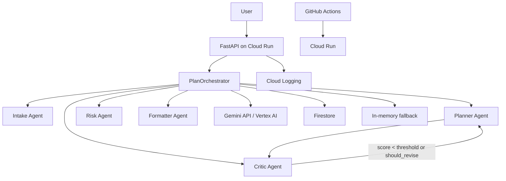

# LoopPlan Agent

LoopPlan Agent は、曖昧な悩みやタスクを **実行可能な計画** に変換する Google Cloud 向けマルチエージェント Web アプリです。FastAPI を Cloud Run に載せ、Gemini / Vertex AI / ADK、Firestore、GitHub Actions を組み合わせて「つくる・まわす・とどける」を満たす構成にしています。

## アーキテクチャ



## マルチエージェント構成

| Agent | 役割 | 主な出力 |
| --- | --- | --- |
| Intake Agent | 入力から目的・制約・期限・曖昧点を抽出 | `IntakeResult` |
| Planner Agent | 実行ステップ、所要時間、優先順位を作成 | `PlanDraft` |
| Critic Agent | 計画を厳しく採点し改善要求を出す | `CriticResult` |
| Risk Agent | 失敗要因と対策を洗い出す | `RiskResult` |
| Formatter Agent | ユーザー向け最終出力へ整形 | `PlanResponse` |

## ループ処理

`PlanOrchestrator.run()` は次の順に動きます。

1. `request_id` を生成
2. Intake Agent 実行
3. Firestore またはメモリから直近計画を取得
4. Planner Agent が初回計画を作成
5. Critic Agent が 0〜100 点で評価
6. Risk Agent がリスクを確認
7. `score < quality_threshold` または `should_revise=true` の場合、改善要求を Planner に戻す
8. 最大 `max_loops` 回まで改善
9. Formatter Agent が最終回答を作成
10. Firestore またはメモリに保存

デフォルトは `quality_threshold=80`、`max_loops=3` です。Critic の score が 80 以上かつ `should_revise=false` なら早期終了します。各ループの改善履歴は `agent_trace` に保存されます。

## 使用 Google Cloud サービス

- **Cloud Run**: FastAPI アプリの実行基盤
- **Gemini API / Vertex AI**: エージェントの JSON 生成
- **Firestore**: リクエスト、最終計画、agent trace、評価スコアの保存
- **Cloud Logging**: アプリログ
- **Artifact Registry**: GitHub Actions から push するコンテナイメージ
- **Workload Identity Federation**: GitHub Actions のキー不要認証

## ローカル実行方法

```bash
python -m venv .venv
source .venv/bin/activate
pip install -r requirements-dev.txt
cp .env.example .env
uvicorn app.main:app --reload --port 8080
```

- Swagger UI: <http://localhost:8080/docs>
- Gemini 未設定でも deterministic fallback で `/api/plan` は動作します。
- Firestore 未設定時は in-memory repository に保存します。

## 環境変数

| 変数 | 例 | 説明 |
| --- | --- | --- |
| `GOOGLE_CLOUD_PROJECT` | `your-project-id` | GCP プロジェクト ID |
| `GOOGLE_CLOUD_LOCATION` | `asia-northeast1` | Vertex AI / Cloud Run リージョン |
| `GEMINI_MODEL` | `gemini-2.5-flash` | Gemini モデル名 |
| `GEMINI_API_KEY` | `...` | API キー方式で使う Gemini キー |
| `USE_VERTEX_AI` | `false` | `true` なら Vertex AI 経由 |
| `FIRESTORE_ENABLED` | `false` | `true` なら Firestore 保存を試行 |
| `RUNTIME_MODE` | `auto` | `auto`, `adk`, `fallback` |
| `LOG_LEVEL` | `INFO` | ログレベル |

## API 仕様

### `GET /`

```json
{"status":"ok","service":"loopplan-agent"}
```

### `GET /health`

```json
{"status":"ok","gemini_configured":true,"firestore_configured":true,"runtime":"adk"}
```

`runtime` は `adk` または `fallback` です。

### `POST /api/plan`

```json
{
  "user_id": "demo_user",
  "message": "Google CloudのAIエージェント開発を2週間で形にしたい",
  "deadline": "2週間後",
  "max_loops": 3,
  "quality_threshold": 80
}
```

主なレスポンス項目:

- `summary`
- `final_plan.steps`
- `risks`
- `alternatives`
- `evaluation_score`
- `loop_count`
- `agent_trace`
- `saved`

### `GET /api/plans/{user_id}`

指定ユーザーの直近計画を返します。

## Cloud Run デプロイ方法

```bash
PROJECT_ID=your-project-id
REGION=asia-northeast1
SERVICE=loopplan-agent

gcloud config set project "$PROJECT_ID"
gcloud services enable run.googleapis.com artifactregistry.googleapis.com firestore.googleapis.com aiplatform.googleapis.com

gcloud artifacts repositories create loopplan --repository-format=docker --location "$REGION" || true
gcloud builds submit --tag "$REGION-docker.pkg.dev/$PROJECT_ID/loopplan/loopplan-agent:latest"

gcloud run deploy "$SERVICE" \
  --image "$REGION-docker.pkg.dev/$PROJECT_ID/loopplan/loopplan-agent:latest" \
  --region "$REGION" \
  --platform managed \
  --allow-unauthenticated \
  --set-env-vars "GOOGLE_CLOUD_PROJECT=$PROJECT_ID,GOOGLE_CLOUD_LOCATION=$REGION,USE_VERTEX_AI=true,FIRESTORE_ENABLED=true,RUNTIME_MODE=auto,GEMINI_MODEL=gemini-2.5-flash"
```

API キー方式を使う場合は Secret Manager に `GEMINI_API_KEY` を置き、Cloud Run の secret env var として設定してください。

## GitHub Actions デプロイ方法

`.github/workflows/deploy-cloud-run.yml` は main ブランチ push で以下を実行します。

1. Python 依存関係をインストール
2. `pytest` 実行
3. Workload Identity Federation で Google Cloud に認証
4. Docker image を Artifact Registry に push
5. Cloud Run に deploy

設定する値:

- Secrets
  - `GCP_PROJECT_ID`
  - `GCP_WORKLOAD_IDENTITY_PROVIDER`
  - `GCP_SERVICE_ACCOUNT`
  - `GEMINI_API_KEY`（Secret Manager の secret 名として参照）
- Variables
  - `GCP_REGION`（未設定時 `asia-northeast1`）

サービスアカウントキー JSON は保存しません。

## Firestore 設定方法

```bash
gcloud services enable firestore.googleapis.com
gcloud firestore databases create --location=asia-northeast1
```

Cloud Run 実行サービスアカウントに `roles/datastore.user` を付与します。`FIRESTORE_ENABLED=false` または認証失敗時はメモリ保存にフォールバックします。

保存項目:

- `user_id`
- `request_id`
- `original_message`
- `final_plan`
- `agent_trace`
- `evaluation_score`
- `created_at`

## ADK 利用箇所

- `app/agents/definitions.py`: 5種類の Agent 定義と Tool 対応を宣言
- `app/agents/adk_runtime.py`: `google.adk.agents.Agent` の構築を隔離
- `app/agents/orchestrator.py`: ADK runtime または fallback runtime を同じインターフェースで呼び出し

ADK の Runner / SessionService はバージョン差分が出やすいため、提出物では ADK Agent 構築を明示しつつ、実行パスは壊れにくい runtime 境界に閉じ込めています。将来の ADK API に合わせる場合は `adk_runtime.py` だけを差し替えれば FastAPI 本体に影響しません。

## フォールバック実装

`app/agents/fallback_runtime.py` は Gemini が未設定、ADK が未インストール、または Gemini JSON が壊れた場合でも API を落とさない deterministic fallback を提供します。Gemini が設定されている場合は `google-genai` で JSON 生成を試み、Pydantic 検証に失敗すると安全なテンプレート出力へ戻します。

## テスト方法

```bash
pytest
```

テスト内容:

- ヘルスチェック
- `/api/plan` 正常系
- 空入力バリデーション
- 最大ループ停止
- 評価スコア閾値以上の早期終了
- schema validation

## sample_requests.http

`sample_requests.http` に以下の例を入れています。

- 学習計画
- ハッカソン開発計画
- 就活ES
- 生活タスク
- 空入力エラー

## 今後の拡張案

- ADK Runner / SessionService による完全なセッション実行
- Firestore の評価データを用いたプロンプト A/B テスト
- Cloud Scheduler + BigQuery による定期評価
- ユーザーのカレンダーや GitHub Issue と連携した実行管理
- 評価データセットと自動採点レポートの追加
- 認証付き UI と plan revision の可視化
