## 0. 全体ループ

まず、アプリ全体の一番大きな流れです。

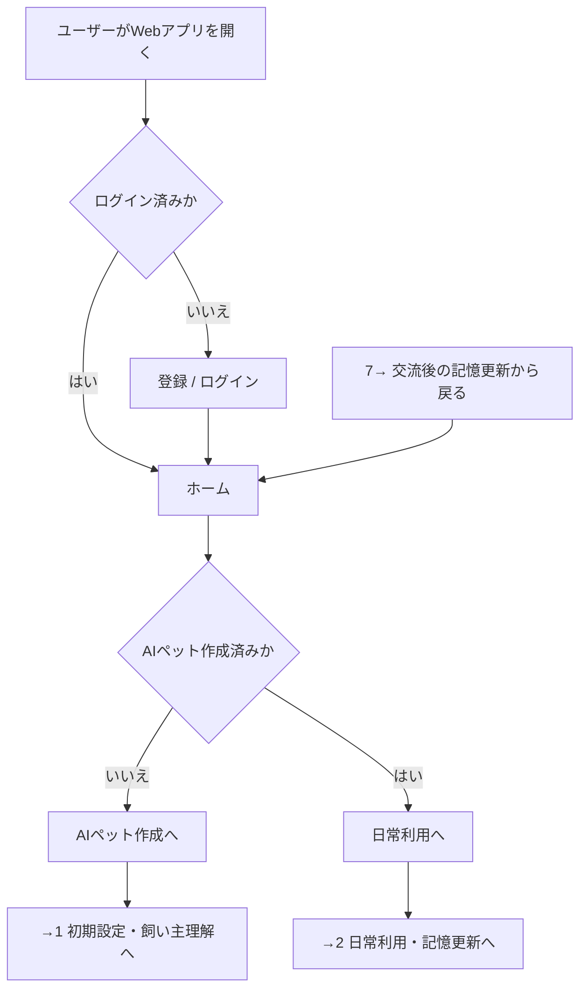

## 1. 初期設定・飼い主理解

ここでは、AIペットの見た目育成ではなく、飼い主理解を育てるための初期データを作ります。

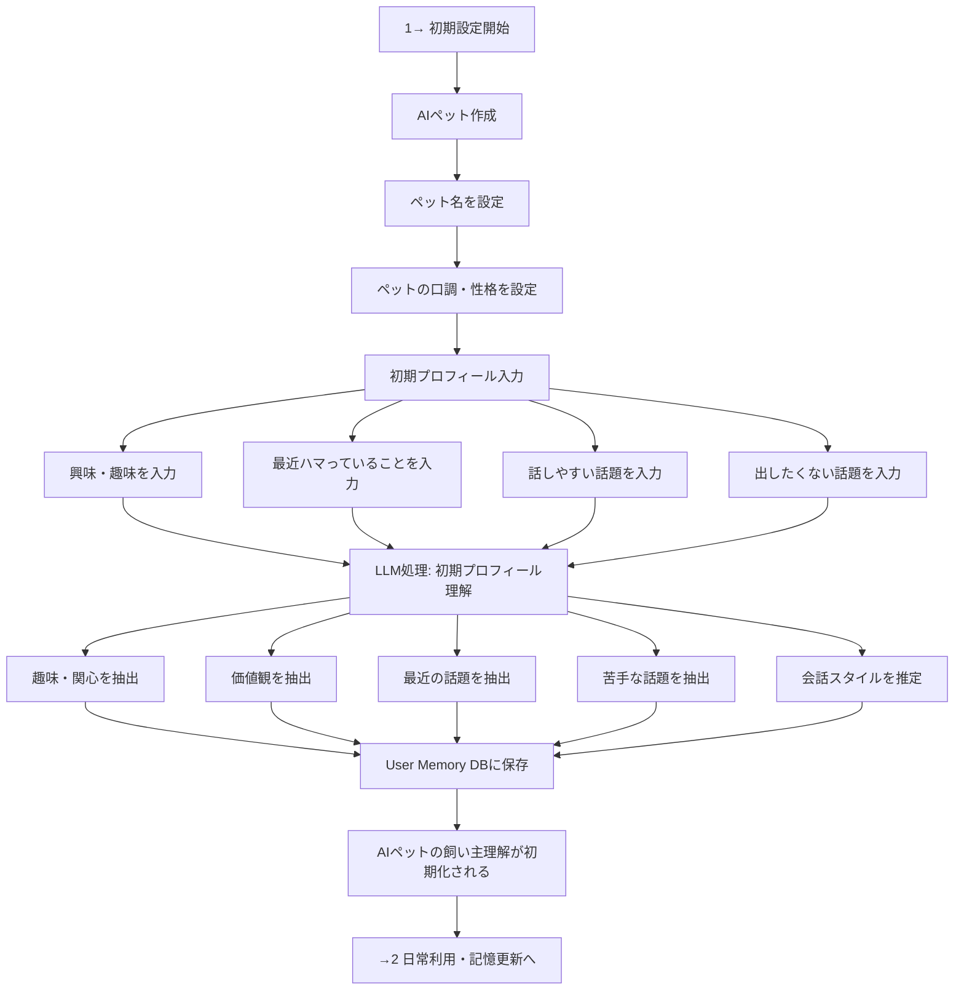

## 2. 日常利用・記憶更新

ここが「ペットを育てる」部分です。
ユーザーが毎回がっつりチャットするのではなく、軽い入力や履歴からLLMが飼い主理解を更新します。

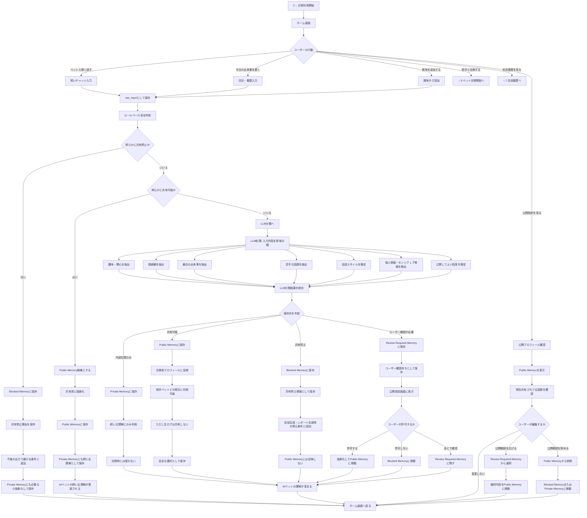

## 3. ペット交換開始

交換は、Webアプリ前提では鳴き声通信 / QRです。
物理NFCタグを使う場合も、NFC自体で情報交換するのではなく、交換URLを開く入口として使います。

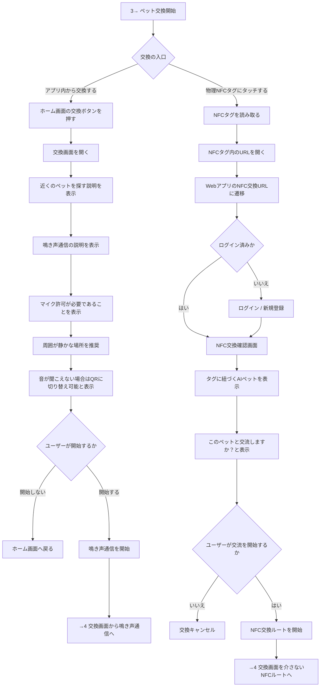

## 4. 交換方法ごとの詳細

ここが今回のポイントです。

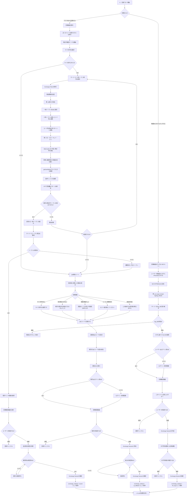

## 5. LLM共通項分析

ここからがAIペットの中核です。
相手に渡すのは生ログではなく、LLMが生成した共有用要約プロフィールだけです。

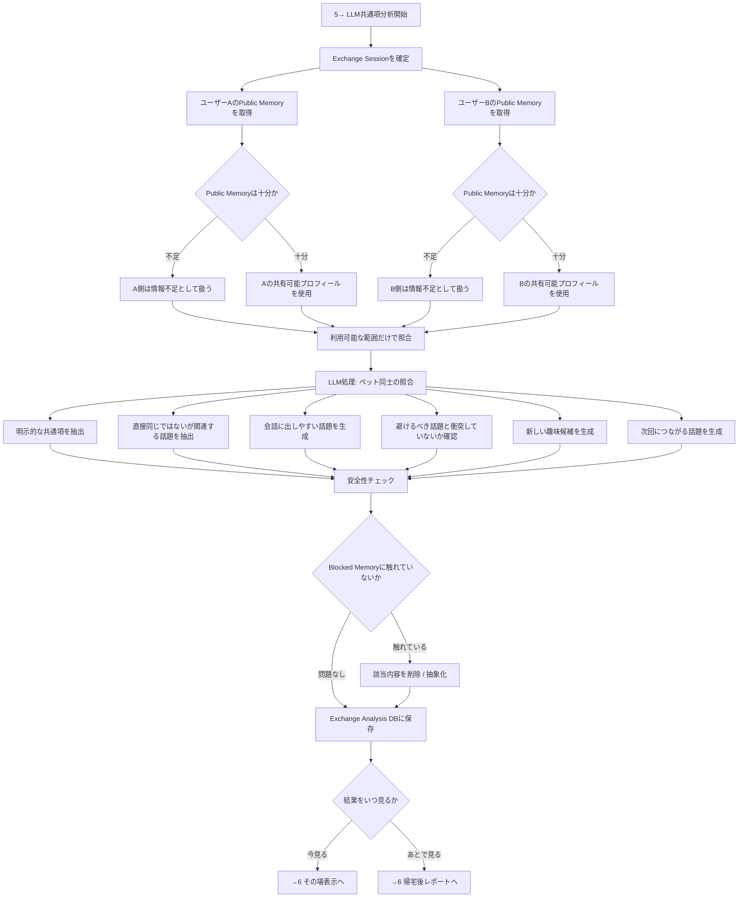

## 6. その場表示・帰宅後レポート

メインは帰宅後です。
ただし、会っている最中にも軽く見られるようにします。

### 6-A. その場表示

その場で出す内容は、重くしすぎない方がよいです。
初対面でも使えるように、個人的すぎる内容は避けます。

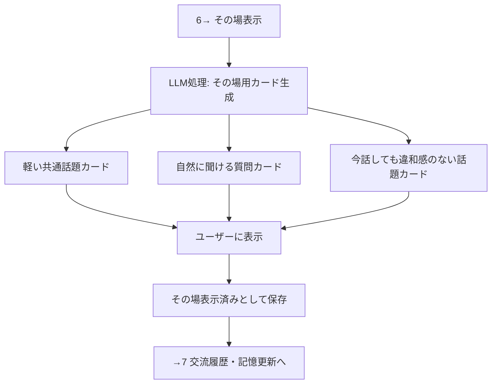

### 6-B. 帰宅後レポート

本命はこちらです。
会話中に急かすのではなく、あとから「次につながる話題」として整理します。

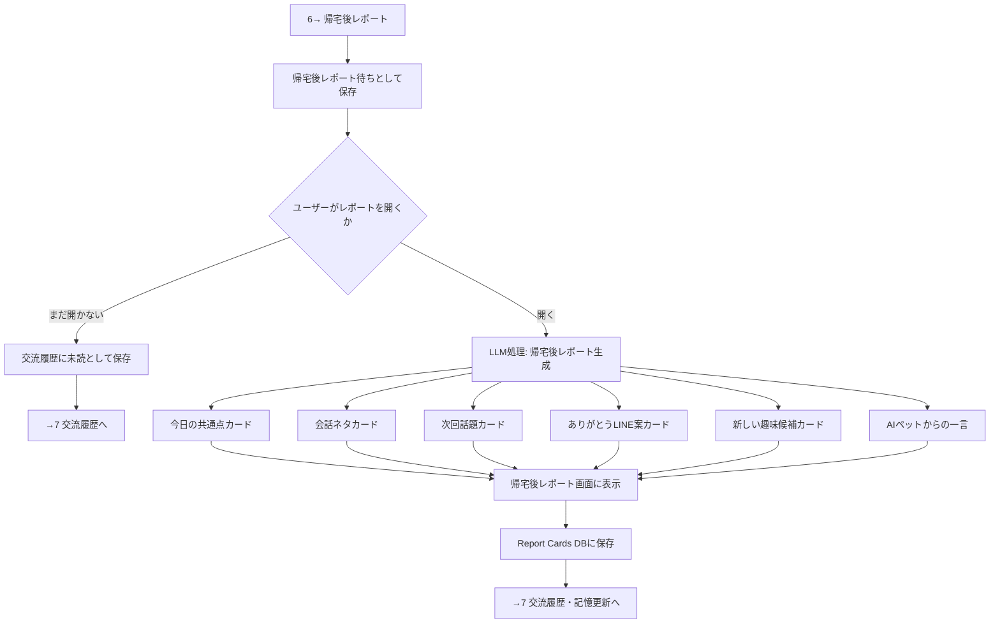

## 7. 交流履歴・飼い主理解への再反映

最後に、ユーザーの反応をもとにAIペットがさらに飼い主を理解します。
これによって、使うほどペットが育つ構造になります。

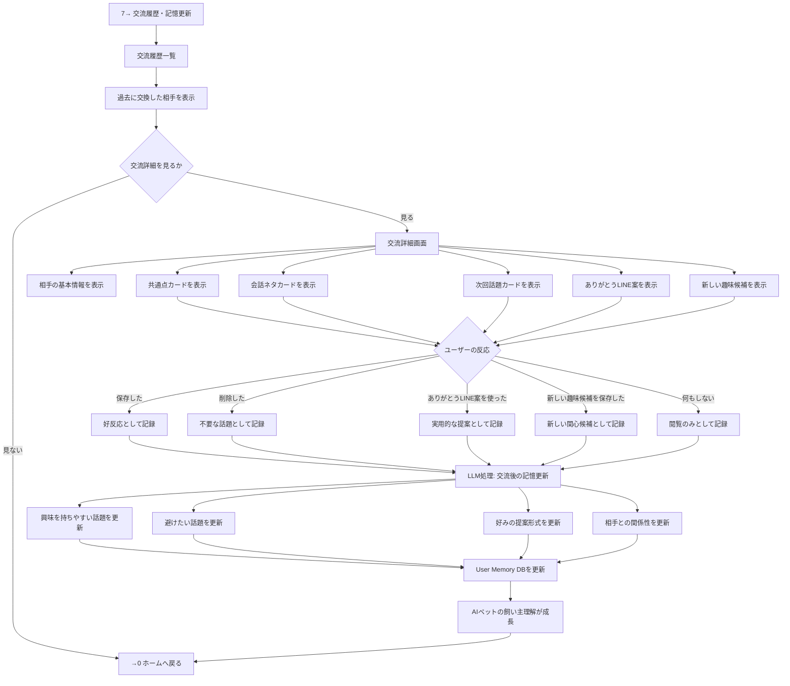

## データ構造も分割して見る

フローだけだと実装イメージがぼやけるので、DBも簡単にまとめます。

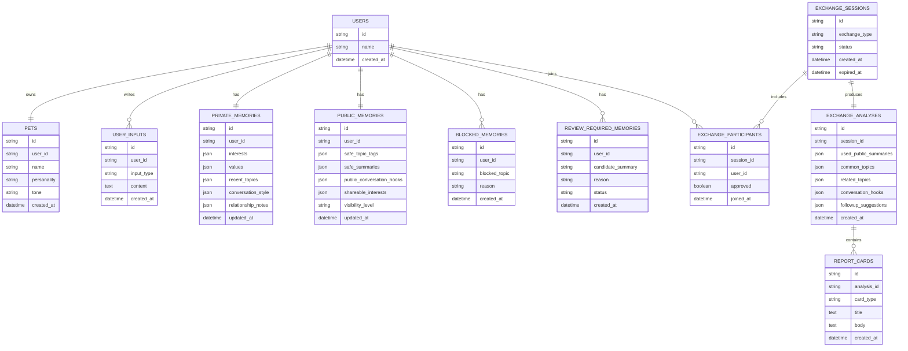

## LLM処理だけを抜き出すとこうです

プロダクト説明やハッカソン資料では、この図がかなり使いやすいと思います。

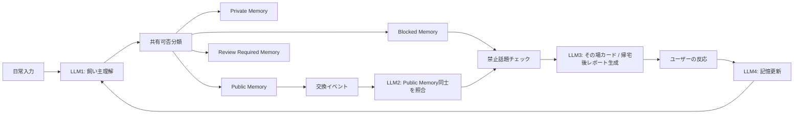