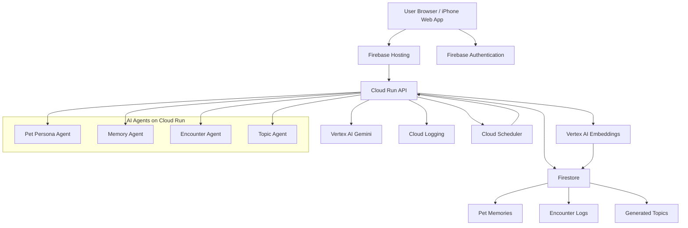

```jsx
Frontend:
- Next.js
- Firebase Hosting
- Firebase Authentication

Backend:
- Cloud Run
- FastAPI or Node.js/Express

AI:
- Vertex AI Gemini
- Vertex AI Embeddings

Database:
- Firestore
- Firestore Vector Search

Async / Scheduled:
- Cloud Scheduler
- 必要ならPub/Sub

Ops:
- Cloud Logging
- Error Reporting
- Secret Manager

Security:
- Firebase Auth ID Token検証
- Firestore Security Rules
- Cloud Runは認証付き
- Gemini用サービスアカウントは最小権限
```

```jsx
Docker構成仕様

1. 方針

本プロジェクトでは、AIペットのバックエンドAPIをDockerコンテナとして構築し、Google Cloud Run上にデプロイする。

フロントエンド、Firestore、Firebase Authentication、Vertex AI Geminiはマネージドサービスを利用するため、Docker化の対象外とする。

2. Docker化対象

Docker化する対象は以下とする。

backend/

主な責務は以下である。

・ユーザーとAIペットの会話API
・ユーザーの趣味嗜好の記憶抽出
・記憶の保存可否・共有可否判定
・相手ペットとの交流処理
・共通話題生成
・Firestoreへの読み書き
・Vertex AI Geminiの呼び出し

3. Docker化しない対象

以下はDocker化しない。

・フロントエンド
・Firestore
・Firebase Authentication
・Vertex AI Gemini
・Cloud Logging
・Secret Manager

フロントエンドはFirebase Hostingへのデプロイを基本とする。

4. ディレクトリ構成

backend/
  app/
    main.py
    agents/
      pet_persona_agent.py
      memory_agent.py
      encounter_agent.py
      topic_agent.py
    services/
      firestore_service.py
      vertex_ai_service.py
      token_service.py
    schemas/
      pet.py
      memory.py
      encounter.py
  requirements.txt
  Dockerfile
  .dockerignore

5. Dockerfile仕様

FROM python:3.12-slim
WORKDIR /app
COPY requirements.txt .
RUN pip install --no-cache-dir -r requirements.txt
COPY app ./app
ENV PORT=8080
CMD exec uvicorn app.main:app --host 0.0.0.0 --port ${PORT:-8080}

6. ポート仕様

Cloud Run上で実行するため、アプリケーションは環境変数PORTで指定されたポートを利用する。

初期値は8080とする。

7. 環境変数

Cloud Runには以下の環境変数を設定する。

GOOGLE_CLOUD_PROJECT
FIRESTORE_DATABASE
VERTEX_AI_LOCATION
GEMINI_MODEL

秘匿情報は環境変数に直接記載せず、必要に応じてSecret Managerを利用する。

8. ローカル実行

ローカルでは以下のコマンドで起動できることを要件とする。

docker build -t ai-pet-api .
docker run -p 8080:8080 ai-pet-api

起動後、以下のURLでヘルスチェックが通ることを確認する。

GET http://localhost:8080/health

9. ヘルスチェック

バックエンドAPIは以下のエンドポイントを持つ。

GET /health

レスポンス例は以下とする。

{
  "status": "ok"
}

10. デプロイ方針

Cloud Runへのデプロイは、DockerイメージをArtifact Registryにpushし、そのイメージをCloud Runへ反映する方式を基本とする。

初期開発段階では手動デプロイを許容する。

将来的にはGitHub ActionsまたはCloud Buildによる自動デプロイを導入する。

11. セキュリティ方針

Cloud Runのサービスアカウントには、必要最小限の権限のみを付与する。

バックエンドAPIはFirebase AuthenticationのIDトークンを検証し、認証済みユーザーのみがペット情報・記憶・交流情報にアクセスできるようにする。

AIエージェントから参照できる記憶は、Firestore上でvisibilityがshareableまたは必要な範囲に限定されたもののみとする。

12. 除外事項

本仕様では、以下は対象外とする。

・Kubernetes / GKE構成
・複数コンテナ構成
・Docker Composeによる本番運用
・ローカルFirestoreエミュレータの詳細設定
・CI/CDの詳細実装
```
